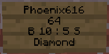

# Hoe gebruik je chestshops?

 1.  Plaats een kist met het item der in wat je wilt verkopen.
 2. Pak een sign een plaats hem op de kist.
    - **Dit moet je op de sign plaatsen.** 
    - Op de eerste lijn van de sign moet je je minecraft username plaatsen _(Let op op hoofdletters.)_
    - Op de tweede lijn typ je hoeveel je er wilt verkopen als er iemand op de sign klikt. 
    - Op de derde lijn typ je **B (Koop Prijs) : (Verkoop Prijs) S**
    - Op de vierde lijn typ je wat je wilt verkopen.

## Voorbeeld.

--

 - Username = Phoenix616 
 - Aantal = 64 
 - Koopprijs = 10 / Verkoopprijs = 5
 - Wat verkoopt ie = Diamond

 3. Dan ben je klaar.
     - Heb je toch problemen. Maak dan een ticket aan.
