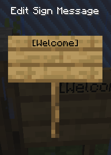
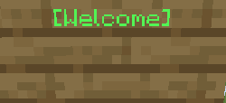

# Hoe zet je je island open voor visitors.

 1. Plaats een sign waar je de warp wil hebben.
    - Op de sign moet staan op de 1ste lijn `[Welcome]` anders werkt ie niet.
  
 ## Voorbeeld

**Als het werkt wordt de sign groen.**

## Hoe visit je een island?
Doe `/is visit (username)`
